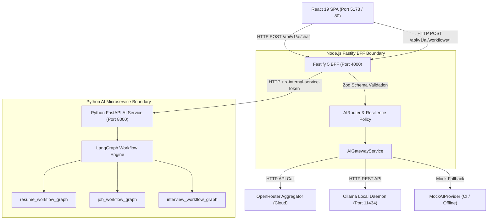

# 🎯 CareerCraft Master System Architecture

> **Authoritative Specification**: This document is the **Master System Architecture Entrypoint** for CareerCraft. It provides a high-level architectural map of system topology, service responsibilities, communication flows, trust boundaries, ADR decisions, and subsystem specifications.

---

## 1. Purpose

`ARCHITECTURE.md` serves as the primary system architecture guide for developers, architects, QA/DevOps engineers, security auditors, and AI coding agents. It establishes service boundaries, data flows, trust zones, and authoritative documentation owners across the CareerCraft multi-service platform.

---

## 2. Architecture Overview

CareerCraft is an enterprise-grade AI Career & Interview Preparation Platform designed using a polyglot microservice topology:
- **Presentation**: Single-Page Application (SPA) built with React 19, TypeScript 5.8, Vite 6, and Tailwind CSS v4.
- **Backend Facade**: Fastify 5 Backend-for-Frontend (BFF) handling security headers, rate limiting, request validation, and Pino logging.
- **Native AI Gateway**: Server-side orchestration engine (`backend/src/services/ai-gateway.service.ts`) managing model aliases, provider fallbacks, timeouts, and circuit breakers.
- **AI Execution Engine**: Python 3.11 FastAPI microservice executing stateful **LangGraph workflow graphs** and factuality validation.

---

## 3. System Context

```text
                                CAREERCRAFT SYSTEM CONTEXT
                                             │
      ┌──────────────────────────────────────┼──────────────────────────────────────┐
      ▼                                      ▼                                      ▼
Candidate / Web Client                Fastify BFF & AI Gateway               External Cloud & Local Models
(Browser SPA)                         (Node.js / TypeScript)                 (OpenRouter / Ollama)
  ├── Interactive CV Builder            ├── API Route Facade (/api/v1)         ├── Claude 3.5 Sonnet
  ├── Job Application Tracker           ├── Native AIGatewayService            ├── GPT-4o-mini
  ├── STAR Coach & Mock Practice        ├── Request Correlation (x-request-id) └── Local Qwen 2.5 Engine
  └── Multilingual i18n (EN/DE/AR)      └── Zod Payload Validation
                                             │
                                             ▼
                                Python FastAPI AI Microservice
                                (LangGraph Workflow Engine)
                                 ├── ATS Resume Optimization Graph
                                 ├── Skill Gap Analysis Graph
                                 └── STAR Interview Coach Graph
```

---

## 4. High-Level System Diagram



---

## 5. Service Topology

| Service Component | Runtime / Framework | Primary Port | Network Visibility | Primary Storage / Execution |
| :--- | :--- | :---: | :---: | :--- |
| **`frontend`** | React 19 / Vite 6 / Nginx | `5173` (Dev) / `80` (Docker) | Public | Browser `localStorage` |
| **`backend`** | Node.js 24 / Fastify 5 / TypeScript 5.8 | `4000` | Internal / Edge | In-Memory / Pino Logs |
| **`ai-service`** | Python 3.11 / FastAPI 0.115 | `8000` | Internal Service Mesh | LangGraph Checkpointers |
| **`litellm-gateway`** | LiteLLM Docker Proxy (Optional) | `4001` | Optional Internal Proxy | Config Yaml |

---

## 6. Service Responsibility Matrix

| Service | Technology | Core Responsibilities | MUST NOT Own | Communication Protocol |
| :--- | :--- | :--- | :--- | :--- |
| **`frontend`** | React 19, TS 5.8 | UI presentation, state, i18n, RTL layout | Provider API keys, DB credentials | HTTP REST / JSON |
| **`backend`** | Fastify 5, Node 24 | API proxy, Zod validation, AI Gateway | Complex LLM state graph execution | HTTP / Fastify Routes |
| **`AIGatewayService`**| TypeScript | Model routing, resilience, circuit breaker | Direct UI rendering, raw DB SQL | Internal TS Class Calls |
| **`ai-service`** | FastAPI, Python 3.11 | LangGraph workflows, STAR scoring, evaluation | Public client auth, static web files | HTTP REST + Internal Token |
| **External Providers** | Cloud APIs / Ollama | Raw LLM token completion | Application business state | HTTPS / REST APIs |

---

## 7. Frontend Architecture

- **Structure**: Located in `src/`. Composed of modular components (`components/ui/`, `components/cv/`, `components/jobs/`, `components/layout/`), page routes (`components/pages/`), state contexts (`context/`), custom hooks (`hooks/`), and utilities (`utils/`).
- **Code Splitting**: Route-level dynamic chunks via `React.lazy()` and `React.Suspense` in `src/App.tsx`.
- **Internationalization**: Locale dictionaries (`en`, `de`, `ar`) managed in `src/utils/i18n.ts` with dynamic `dir="rtl"` HTML root attribute assignment.
- **Design System**: Tailwind CSS v4 utility classes and custom CSS variables defined in `src/index.css`. See [`docs/UI-POLICY.md`](docs/UI-POLICY.md).

---

## 8. Fastify BFF Architecture

- **Structure**: Located in `backend/src/`. Application lifecycle built in `app/app.ts`, server listener in `server.ts`.
- **Middleware Chain**:
  1. `@fastify/cors` $\rightarrow$ Allowed origin enforcement.
  2. `@fastify/helmet` $\rightarrow$ Security header injection (CSP, HSTS, X-Frame-Options).
  3. `@fastify/rate-limit` $\rightarrow$ Sliding-window limit (100 req/min/IP).
  4. Correlation ID $\rightarrow$ `x-request-id` header injection and propagation.
  5. Pino Logger $\rightarrow$ High-performance structured JSON logging.
- **API Contracts**: REST endpoints under `/api/v1/`. Payload schemas validated via Zod (`backend/src/schemas/`). See [`docs/API.md`](docs/API.md).

---

## 9. AI Gateway Architecture

- **Service Location**: `backend/src/services/ai-gateway.service.ts`.
- **Provider Adapters**:
  - `OpenRouterProvider`: Aggregates cloud LLMs via OpenRouter API.
  - `OllamaProvider`: Connects to local Ollama daemon (`http://127.0.0.1:11434`).
  - `MockAIProvider`: Zero-network mock provider for deterministic CI/CD testing.
- **Resilience Engine**:
  - **Timeout Policy**: Enforces 30,000 ms execution limit per request.
  - **Retry Policy**: Bounded 1 retry for transient network and 5xx server errors.
  - **Circuit Breaker**: Trips to `OPEN` after 3 consecutive failures; re-tests via `HALF_OPEN` after 30s cooldown.
  - See [`docs/AI-GATEWAY.md`](docs/AI-GATEWAY.md) and [`ADR-002`](docs/ADR-002_AI_GATEWAY_ARCHITECTURE.md).

---

## 10. Python AI Service Architecture

- **Service Location**: `ai-service/app/main.py`.
- **Framework**: FastAPI 0.115 + Pydantic 2.8.
- **Responsibilities**: Executes complex, stateful multi-step AI reasoning workflows that require graph checkpointing and factuality validation.
- **Authentication**: Accepts requests bearing `x-internal-service-token` forwarded by the Fastify BFF. See [`ADR-006`](docs/ADR-006_PYTHON_AI_SERVICE_ARCHITECTURE.md).

---

## 11. LangGraph Boundaries

- **Boundary Policy**: Direct single-prompt completions (e.g. general chat, quick suggestions) execute via the Fastify **`AIGatewayService`**. Complex multi-node state graphs execute in the Python AI Service via **LangGraph**.
- **Graph Inventory**:
  - `resume_workflow_graph`: ATS analysis $\rightarrow$ skill extraction $\rightarrow$ bullet re-writing.
  - `job_workflow_graph`: Job posting parsing $\rightarrow$ skill gap identification.
  - `interview_workflow_graph`: Question generation $\rightarrow$ STAR coaching $\rightarrow$ evaluation scoring.
- See [`ADR-005`](docs/ADR-005_LANGGRAPH_USAGE_BOUNDARIES.md) and [`ADR-007`](docs/ADR-007_WORKFLOW_STATE_AND_CHECKPOINTING.md).

---

## 12. Provider Routing Architecture

Task-based model aliases map candidate requests to model endpoints:

| Model Alias | Default Target Model | Primary Provider | Purpose / Task |
| :--- | :--- | :--- | :--- |
| `career-fast` | `openai/gpt-4o-mini` | OpenRouter (Cloud) | Resume bullet optimization, fast suggestions |
| `career-reasoning` | `anthropic/claude-3.5-sonnet` | OpenRouter (Cloud) | STAR answer evaluation, mock interview feedback |
| `career-private` | `qwen2.5:7b-instruct` | Ollama (Local) | Local-first PII candidate data processing |

See [`ADR-004`](docs/ADR-004_PROVIDER_ROUTING_STRATEGY.md).

---

## 13. Request / Data Flows

```text
[Candidate Browser]
        │
        ▼  POST /api/v1/ai/chat  (JSON payload)
[Fastify BFF Middleware]
        ├── 1. Validate Zod Schema (chatCompletionRequestSchema)
        ├── 2. Inject x-request-id Header
        └── 3. Invoke AIGatewayService.complete()
                     │
                     ▼
             [AIRouter / Alias Resolution]
                     │
         ┌───────────┴───────────┐
         ▼                       ▼
 [OpenRouterProvider]   [OllamaProvider]
         │                       │
         └───────────┬───────────┘
                     ▼
      [ResiliencePolicy Executed] (Timeout 30s / Circuit Breaker Check)
                     │
                     ▼  200 OK Response Envelope
             [Candidate Browser]
```

---

## 14. Trust & Security Boundaries

- **Browser Zone (Untrusted)**: Client SPA running in user browser. Secrets MUST NOT be stored here.
- **BFF Zone (Trusted Facade)**: Fastify service running in private network. Houses `OPENROUTER_API_KEY` and validates all incoming payloads.
- **Internal Service Mesh Zone**: HTTP link between Fastify BFF and Python FastAPI AI Service protected via internal secret token (`x-internal-service-token`).
- **Telemetry Sanitization**: PII, credentials, and full prompt contents are stripped from OpenTelemetry span attributes.

---

## 15. Observability Architecture

- **Structured Logging**: High-performance Pino JSON logger in Fastify BFF outputting `reqId`, `url`, `statusCode`, `responseTime`, and `providerUsed`.
- **Correlation IDs**: `x-request-id` header generated by Fastify BFF and forwarded to Python AI service and upstream logs.
- **Distributed Tracing**: In-memory OpenTelemetry tracer (`backend/src/telemetry/tracer.ts`) recording span metrics.
- See [`docs/OBSERVABILITY.md`](docs/OBSERVABILITY.md).

---

## 16. Deployment Architecture

- **Containerization**: Multi-stage Docker build files (`Dockerfile` for Nginx frontend, `backend/Dockerfile` for Fastify BFF, `ai-service/Dockerfile` for Python service).
- **Orchestration**: `docker-compose.yml` orchestrating local multi-container topology.
- See [`docs/DEPLOYMENT.md`](docs/DEPLOYMENT.md).

---

## 17. CI/CD Architecture

- **Pipeline File**: `.github/workflows/ci.yml`.
- **Quality Gates**: Executes Pytest suite (13 tests), Vitest suite (79 tests), ESLint, Fastify compilation (`tsc`), and Vite frontend production build on every push/PR to `main`.

---

## 18. Architectural Boundaries

- **Frontend Boundary (`src/`)**: Presentation components, i18n translation strings, client hooks.
- **Backend Boundary (`backend/src/`)**: Fastify routes, Zod schemas, Pino logging, AI Gateway adapters.
- **AI Microservice Boundary (`ai-service/app/`)**: FastAPI endpoints, LangGraph state graphs, Pydantic schemas.
- **Constants Boundary (`src/utils/constants.ts`)**: Application-wide storage keys, route paths, supported languages.

---

## 19. Source-of-Truth Matrix

| Architectural Domain | Authoritative Specification | Code / Config Artifact |
| :--- | :--- | :--- |
| **REST API Reference** | [`docs/API.md`](docs/API.md) | `backend/src/routes/` |
| **AI Gateway & Resilience** | [`docs/AI-GATEWAY.md`](docs/AI-GATEWAY.md) | `backend/src/services/ai-gateway.service.ts` |
| **Deployment & Containers** | [`docs/DEPLOYMENT.md`](docs/DEPLOYMENT.md) | `docker-compose.yml`, `Dockerfile` |
| **UI Design & Tokens** | [`docs/UI-POLICY.md`](docs/UI-POLICY.md) | `src/index.css`, `src/components/ui/` |
| **i18n & Translation Governance**| [`docs/LANGUAGE-POLICY.md`](docs/LANGUAGE-POLICY.md) | `src/utils/i18n.ts`, `scripts/check-i18n.js` |
| **Observability & Logging** | [`docs/OBSERVABILITY.md`](docs/OBSERVABILITY.md) | `backend/src/telemetry/tracer.ts` |
| **Performance Engineering** | [`docs/PERFORMANCE.md`](docs/PERFORMANCE.md) | `vite.config.ts`, `src/App.tsx` |

---

## 20. ADR Index

Technical decisions documented in `docs/`:

- [`ADR-002: Native Fastify AI Gateway Architecture`](docs/ADR-002_AI_GATEWAY_ARCHITECTURE.md)
- [`ADR-003: OmniRoute vs LiteLLM Responsibility Matrix`](docs/ADR-003_OMNIROUTE_VS_LITELLM_RESPONSIBILITY.md)
- [`ADR-004: Provider Routing Strategy & Fallback Order`](docs/ADR-004_PROVIDER_ROUTING_STRATEGY.md)
- [`ADR-005: LangGraph Usage Boundaries & Workflow Graphs`](docs/ADR-005_LANGGRAPH_USAGE_BOUNDARIES.md)
- [`ADR-006: Python AI Microservice Architecture`](docs/ADR-006_PYTHON_AI_SERVICE_ARCHITECTURE.md)
- [`ADR-007: Workflow State Management & Checkpointing`](docs/ADR-007_WORKFLOW_STATE_AND_CHECKPOINTING.md)

---

## 21. Documentation Map

```text
CareerCraft Documentation Architecture
├── README.md                      (Primary Human Entrypoint & Quickstart)
├── AGENTS.md                      (Root AI Coding Agent Operating Manual)
├── ARCHITECTURE.md                (Master System Architecture Entrypoint)
├── DEVELOPMENT.md                 (Future - Developer Onboarding & Local Setup)
├── TESTING.md                     (Future - Test Strategy & Release Gate Map)
├── SECURITY.md                    (Future - Security Policy & Threat Baseline)
└── docs/                          (Subsystem Specifications & Policies)
    ├── AI-GATEWAY.md
    ├── API.md
    ├── DEPLOYMENT.md
    ├── INTERNATIONALIZATION.md
    ├── LANGUAGE-POLICY.md
    ├── OBSERVABILITY.md
    ├── PERFORMANCE.md
    ├── UI-POLICY.md
    ├── ADRs/ (ADR-002 .. ADR-007)
    └── audit/ (Immutable Historical Audit Logs)
```

---

## 22. Known Documentation Drift

1. **TypeScript Badge Version**: `README.md` badge states TS `5.7`; codebase uses TS `5.8.2` (`package.json`).
2. **React Badge Version**: `README.md` badge states React `19.0`; codebase uses React `19.2.4` (`package.json`).
3. **Frontend Docker Node Version**: `Dockerfile` uses `node:20-alpine`, while `backend/Dockerfile` uses `node:24-alpine`.
4. **LiteLLM vs Native AI Gateway**: `README.md` emphasizes LiteLLM proxy container on port 4001, whereas authoritative `docs/AI-GATEWAY.md` clarifies that the native Fastify `AIGatewayService` is the primary operational gateway.
5. **External Telemetry Collectors**: `README.md` notes external collector containers, whereas `docs/OBSERVABILITY.md` Section 7 clarifies that OTEL Collectors are not currently deployed in `docker-compose.yml`.

---

## 23. Architectural Invariants

1. **Frontend Secret Isolation**: Frontend SPA code MUST NOT house AI provider secrets or direct database connection strings.
2. **Gateway Abstraction**: All LLM provider completions MUST flow through `AIGatewayService` or Python FastAPI proxy routes behind adapter interfaces.
3. **No Direct JS Files**: All application code in `src/` MUST be strictly typed TypeScript (`.ts` / `.tsx`). Plain `.js` files are forbidden.
4. **Single Constant Registry**: Storage keys, language codes, and route paths MUST be registered in `src/utils/constants.ts`.
5. **Release Gate Verification**: No change is complete without executing `npm run validate`.

---

## 24. AI Agent Architecture Safety Rules

Before modifying system architecture, AI agents MUST:
1. Read [`AGENTS.md`](AGENTS.md).
2. Identify the target service (`src/`, `backend/`, `ai-service/`).
3. Consult the relevant subsystem documentation in `docs/` and relevant ADRs (`ADR-002` through `007`).
4. Verify actual implementation in code before making assumptions.
5. Execute `npm run validate` to verify zero architectural regressions.

---

## 25. Future Architecture Documentation Links

- [Root AI Coding Agent Operating Manual (`AGENTS.md`)](AGENTS.md)
- [BFF REST API Reference (`docs/API.md`)](docs/API.md)
- [Native AI Gateway Specification (`docs/AI-GATEWAY.md`)](docs/AI-GATEWAY.md)
- [Container Deployment Architecture (`docs/DEPLOYMENT.md`)](docs/DEPLOYMENT.md)
- [UI Design System Governance (`docs/UI-POLICY.md`)](docs/UI-POLICY.md)
- [Language & i18n Governance (`docs/LANGUAGE-POLICY.md`)](docs/LANGUAGE-POLICY.md)
